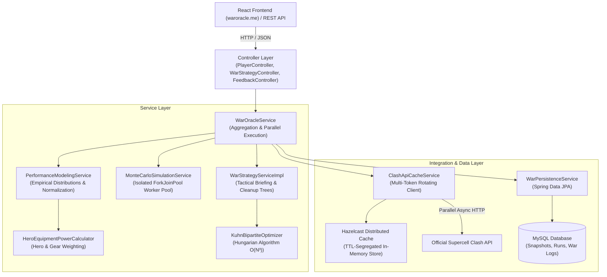

# WarOracle — Backend Engine

[](https://openjdk.org/)
[](https://spring.io/projects/spring-boot)
[](https://hazelcast.com/)
[](https://www.mysql.com/)
[](https://waroracle.me)
[](LICENSE)

> **Live Platform:** [waroracle.me](https://waroracle.me)  
> High-throughput predictive analytics, probabilistic outcome modeling, and automated war strategy optimization for competitive *Clash of Clans* Clan Wars and Clan War Leagues (CWL).

---

## 📌 Table of Contents

- [Overview](#-overview)
- [System Architecture](#-system-architecture)
- [Core Engines](#-core-engines)
  - [1. Monte Carlo War Simulation Engine](#1-monte-carlo-war-simulation-engine)
  - [2. Kuhn-Munkres Strategic War Planner](#2-kuhn-munkres-strategic-war-planner)
  - [3. Empirical Modeling & Hero Equipment Power](#3-empirical-modeling--hero-equipment-power)
- [High-Performance JVM Optimizations](#-high-performance-jvm-optimizations)
- [Tech Stack](#-tech-stack)
- [REST API Reference](#-rest-api-reference)
- [Configuration & Environment Variables](#-configuration--environment-variables)
- [Local Development Setup](#-local-development-setup)
- [Topics & Categorization](#-topics--categorization)
- [License](#-license)

---

## 📖 Overview

In competitive *Clash of Clans*, clan wars frequently come down to decimal percentage points of destruction and attack assignment efficiency. Traditional trackers only display past statistics; **WarOracle** projects the future state of an active war using mathematical modeling.

### Key Capabilities:
- **War Outcome Forecasting:** Simulates up to 50,000 full-scale war runs in sub-second latency to generate win, loss, and draw probabilities alongside 95% confidence intervals for stars and total destruction percentage.
- **Kuhn-Munkres Target Assignment:** Solves the maximum-utility attacker-to-defender assignment problem as an $O(N^3)$ bipartite graph matching problem under selectable tactical doctrines (`SAFE`, `BALANCED`, `AGGRESSIVE`).
- **Dynamic Cleanup & Contingency Planning:** Generates second-wave contingency plans, base vulnerability matrices, and opponent threat briefings.
- **Hero Equipment & Defense Calibration:** Normalizes player attacking strength against defender base strength using live equipment levels, Town Hall deltas, and empirical prior performance distributions.

---

## 🏗 System Architecture

WarOracle follows a layered architecture with separation of concerns across presentation, domain logic, simulation workers, and persistence.



---

## ⚙ Core Engines

### 1. Monte Carlo War Simulation Engine

The simulation engine evaluates the stochastic nature of clan wars across thousands of permutations.

```
       ┌────────────────────────────────────────────────────────┐
       │                Active War State Ingestion               │
       │    (Town Hall levels, remaining attacks, live stars)   │
       └───────────────────────────┬────────────────────────────┘
                                   │
                                   ▼
       ┌────────────────────────────────────────────────────────┐
       │           Wave 1: Primary Target Resolution            │
       │  (Mirror offset candidates: [0, -1, +1, -2, +2])        │
       └───────────────────────────┬────────────────────────────┘
                                   │
                                   ▼
       ┌────────────────────────────────────────────────────────┐
       │           Wave 2+: Dynamic Cleanup Attacks             │
       │  (Prioritizes lowest-starred bases within reach)       │
       └───────────────────────────┬────────────────────────────┘
                                   │
                                   ▼
       ┌────────────────────────────────────────────────────────┐
       │          Statistical Aggregation (50,000 Iterations)   │
       │  • Win / Loss / Draw Probabilities                     │
       │  • Expected Star & Destruction Distributions           │
       │  • 95% Confidence Intervals & Verdict Determination    │
       └────────────────────────────────────────────────────────┘
```

#### Multi-Wave Execution Cycle:
1. **Wave 1 (Primary Attacks):** Attackers evaluate target bases starting with their direct mirror position, then testing adjacent offsets ($\pm 1, \pm 2$).
2. **Wave 2+ (Cleanup Attacks):** Remaining attacks target the lowest-starred enemy bases within the player's viable Town Hall difference threshold ($\Delta \text{TH} \ge -1$).
3. **Attack Execution:** Probabilities of achieving 0, 1, 2, or 3 stars and destruction percentiles are sampled from pre-calculated empirical matchup distributions adjusted for defender defense ratings.

---

### 2. Kuhn-Munkres Strategic War Planner

Optimal war target assignment is mathematically formulated as a **Maximum Weight Bipartite Matching** problem.

Given $N$ attackers and $M$ defender bases, the utility weight $U_{i, j}$ of assigning attacker $i$ to defender base $j$ is computed as:

$$U_{i, j} = P_{3\text{star}}(i, j) \cdot W_{\text{stars}} + \mathbb{E}[\text{Destruction}_{i, j}] \cdot W_{\text{dest}} - \text{Penalty}(\Delta \text{TH}) + \text{TacticalBias}(\text{Mode})$$

The solver (`KuhnBipartiteOptimizer`) implements the Hungarian algorithm in $O(N^3)$ time, converting the rectangular matrix into a square cost matrix with neutral padding and computing the globally optimal 1-to-1 match.

#### Supported Tactical Doctrines:
- **`SAFE`**: Prioritizes guaranteed 3-stars and bottom-up stability; heavily penalizes attacking upwards against higher Town Halls.
- **`BALANCED`**: Maximizes total expected clan stars across the entire roster while maintaining cleanup flexibility.
- **`AGGRESSIVE`**: Encourages top players to hit up or secure early stars on high-value opponent targets to expose cleanup opportunities for the lower roster.

---

### 3. Empirical Modeling & Hero Equipment Power

Rather than relying purely on static Town Hall levels, the performance modeling layer factors in granular combat indicators:

- **Hero & Equipment Weights:** Evaluates active equipment levels (e.g., Giant Gauntlet, Frozen Arrow, Eternal Tome, Fireball) via `HeroEquipmentPowerCalculator` to determine true offensive potency.
- **Town Hall Deltas:** Maps matchups across normalized discrete offsets:
  $$\Delta \text{TH} \in \{-2, -1, 0, +1, +2\}$$
- **Historical Attack Normalization:** Calibrates attack participation rates and star probability distributions against recorded clan war history and live battle logs.

---

## ⚡ High-Performance JVM Optimizations

Simulating 50,000 war iterations under active HTTP traffic requires low memory allocation and predictable latency:

1. **Dedicated Worker Isolation (`ForkJoinPool`):**  
   Simulations execute inside an isolated pool sized at $\max(1, \text{cores} - 1)$, preventing CPU starvation on the default JVM `commonPool` and ensuring Hazelcast and web request threads remain responsive.

2. **Primitive Array Lookup Tables:**  
   Replaces nested `Map<Integer, MatchupStarProbability>` lookups with flattened 1D primitive `double[]` arrays indexed by direct pointer math:
   ```java
   int offset = (clampedDiff + 2) * PROB_VALUES_PER_SLOT;
   double prob3 = probRow[offset + 3];
   ```

3. **Bit-Packed Return Primitives (Zero-Heap Hot Loop):**  
   Attack results pack 32-bit star counts and 32-bit destruction values into a single 64-bit primitive `long`:
   ```java
   // High 32 bits = Stars (0-3), Low 32 bits = Destruction * 100
   return ((long) stars << 32) | ((long) Math.round(destruction * 100.0) & 0xFFFFFFFFL);
   ```
   *This completely eliminates millions of short-lived object allocations per request, minimizing GC pauses.*

---

## 🛠 Tech Stack

| Layer | Technology |
| :--- | :--- |
| **Language & Runtime** | Java 21 (LTS) |
| **Framework** | Spring Boot 4.1.1 (WebMVC, Security, Validation, Data JPA) |
| **In-Memory Cache** | Hazelcast In-Memory Data Grid (IMDG) |
| **Database & ORM** | MySQL 8.0+ with Hibernate / Spring Data JPA |
| **Optimization Algorithms** | Kuhn-Munkres (Hungarian) Bipartite Matching Solver, Monte Carlo Engine |
| **Build & Utilities** | Apache Maven, Project Lombok |
| **Frontend Companion** | React, TypeScript, Tailwind CSS ([waroracle.me](https://waroracle.me)) |

---

## 📡 REST API Reference

Base context path: `/warOracle`

| HTTP Method | Endpoint | Description |
| :--- | :--- | :--- |
| `GET` | `/warOracle/player/{playerTag}` | Fetches player details, clan affiliation, and current live war status. |
| `GET` | `/warOracle/clan/{clanTag}` | Fetches clan details, roster statistics, and active war state. |
| `GET` | `/warOracle/qualities` | Returns simulation quality tiers (`LOW`, `MEDIUM`, `HIGH`, `MAX`) and iteration limits. |
| `POST` | `/warOracle/performance-model` | Builds and returns the empirical matchup performance model for an active war. |
| `POST` | `/warOracle/simulate` | Executes full Monte Carlo war simulation and returns projected outcome distributions. |
| `POST` | `/warOracle/strategy/plan` | Generates Kuhn-Munkres optimal attacker assignments, contingencies, and threat briefing. |
| `POST` | `/warOracle/feedback` | Submits user feedback, accuracy ratings, and comments. |

### Sample Simulation Request
```json
POST /warOracle/simulate
Content-Type: application/json

{
  "clanTag": "#2PP",
  "quality": "HIGH"
}
```

### Sample Simulation Response
```json
{
  "status": "SUCCESS",
  "data": {
    "winProbability": 0.742,
    "lossProbability": 0.228,
    "drawProbability": 0.030,
    "verdict": "HOME_WIN",
    "dataConfidence": "HIGH",
    "iterationsRun": 20000,
    "executionTimeMillis": 48,
    "homeClanPrediction": {
      "clanName": "My Clan",
      "expectedStars": 42.6,
      "expectedDestruction": 96.8,
      "perfectWarProbability": 0.12,
      "confidenceInterval": {
        "lowerBoundStars": 40,
        "upperBoundStars": 44,
        "confidenceLevel": 0.95
      }
    }
  },
  "traceId": "c8f1e940-9a22-48df-b59a"
}
```

---

## 🔧 Configuration & Environment Variables

WarOracle is configured via `application.properties` and supports dynamic override through environment variables:

| Variable | Description | Default |
| :--- | :--- | :--- |
| `CLASH_API_TOKENS` | Comma-separated Supercell Developer API JWT tokens (for rotation) | *(None)* |
| `CLASH_API_TOKEN` | Single Supercell API token fallback | *(Embedded developer key)* |
| `DB_URL` | JDBC connection URL for MySQL | `jdbc:mysql://localhost:3306/waroracle?...` |
| `DB_USERNAME` | MySQL database username | `root` |
| `DB_PASSWORD` | MySQL database password | `root` |
| `HAZELCAST_CLUSTER_NAME` | Hazelcast cluster identifier | `dev` |
| `HAZELCAST_ADDRESSES` | Comma-separated Hazelcast node network addresses | `127.0.0.1:5701` |

---

## 💻 Local Development Setup

### 1. Prerequisites
- **JDK 21** or higher
- **Maven 3.9+**
- **MySQL 8.0+**
- Supercell Clash of Clans Developer API Token ([developer.clashofclans.com](https://developer.clashofclans.com/))

### 2. Clone & Build
```bash
# Clone the repository
git clone https://github.com/KavinkumarAndroidDev/WarOracle.git
cd WarOracle

# Build with Maven
mvn clean package -DskipTests
```

### 3. Start Required Services
Ensure MySQL is running locally and create the database (if not automatically created):
```sql
CREATE DATABASE IF NOT EXISTS waroracle;
```

### 4. Run the Application
```bash
# Run with local environment variables
export CLASH_API_TOKEN="your_supercell_jwt_token_here"
export DB_USERNAME="root"
export DB_PASSWORD="your_password"

mvn spring-boot:run
```

The server will start on port `8080`. You can verify it by requesting:
```bash
curl http://localhost:8080/warOracle/qualities
```

---

## 🏷 Topics & Categorization

`clash-of-clans` • `monte-carlo-simulation` • `game-simulation` • `hungarian-algorithm` • `bipartite-matching` • `java` • `spring-boot` • `hazelcast` • `mysql` • `react` • `game-analytics` • `clean-architecture`

---

## 📄 License

This project is licensed under the MIT License — see the [LICENSE](LICENSE) file for details.
