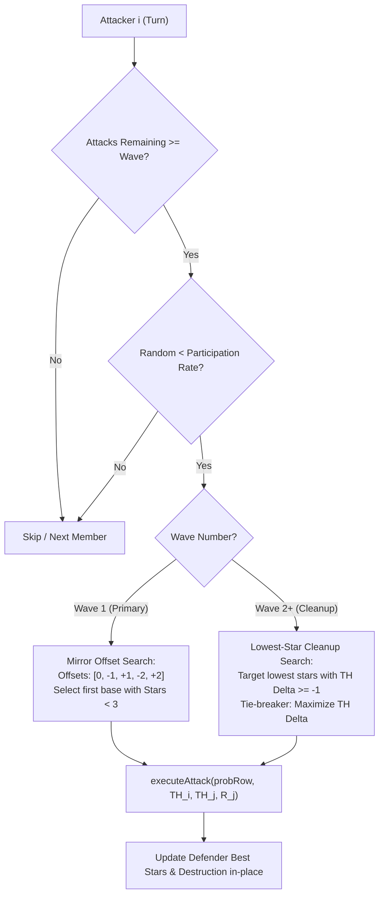

# Mathematical Specification: Monte Carlo War Simulation Engine

> Technical specification and mathematical formulation of the stochastic war simulation engine implemented in `com.kkdev.waroracle.service.MonteCarloSimulationService`.

---

## 1. Mathematical Formulation of Clan War Outcomes

In *Clash of Clans*, a clan war between Team $H$ (Home) and Team $O$ (Opponent) is contested across $N$ bases per team. Each member possesses up to $K$ attacks ($K \in \{1, 2\}$).

The final war score is determined lexicographically:
1. **Total Best Stars:** $S = \sum_{j=1}^{N} \max_{k} \left( \text{Stars}_{j}^{(k)} \right)$, where $\text{Stars}_j \in \{0, 1, 2, 3\}$.
2. **Team Destruction Percentage (Tie-breaker):** $D = \frac{1}{N} \sum_{j=1}^{N} \max_{k} \left( \text{Destruction}_{j}^{(k)} \right)$, where $\text{Destruction}_j \in [0.0, 100.0]$.

The war outcome $Y \in \{+1 \text{ (Home Win)}, 0 \text{ (Draw)}, -1 \text{ (Opponent Win)}\}$ for a single simulated trial is defined as:

$$Y = \begin{cases} 
+1 & \text{if } S_H > S_O \lor (S_H = S_O \land D_H > D_O) \\
-1 & \text{if } S_H < S_O \lor (S_H = S_O \land D_H < D_O) \\
0 & \text{if } S_H = S_O \land D_H = D_O 
\end{cases}$$

---

## 2. Stochastic Attack Resolution Model

When attacker $i$ with Town Hall level $\text{TH}_i$ attacks defender $j$ with Town Hall $\text{TH}_j$ and defense rating $R_j$, the Town Hall delta is clamped to a 5-slot discrete continuum:

$$\Delta \text{TH} = \text{clamp}(\text{TH}_i - \text{TH}_j, -2, +2)$$

### 2.1 Defense-Adjusted Probability Density
The player's baseline star probabilities $\mathbf{p} = [p_0, p_1, p_2, p_3]$ for $\Delta \text{TH}$ are adjusted against defender strength $R_j \in [0.6, 1.4]$:

$$p_3' = \text{clamp}\left( \frac{p_3}{R_j}, 0.01, 0.99 \right)$$

The remaining probability mass $1 - p_3'$ is renormalized across the lower star tiers:

$$p_k' = \left( \frac{p_k}{\sum_{m=0}^{2} p_m} \right) \cdot (1 - p_3') \quad \text{for } k \in \{0, 1, 2\}$$

### 2.2 Continuous Destruction Sampling
Given the simulated discrete outcome $k \in \{0, 1, 2, 3\}$ drawn via uniform random variate $U \sim \text{Uniform}(0, 1)$, continuous destruction $D \in [0, 100]$ is sampled conditionally:

$$D \mid k = \begin{cases}
\text{Uniform}(10.0, \text{clamp}(\mathbb{E}[D], 15.0, 49.0)) & k = 0 \\
\text{Uniform}(50.0, \text{clamp}(\max(\mathbb{E}[D], 60.0), 51.0, 85.0)) & k = 1 \\
\text{Uniform}(50.0, \text{clamp}(\max(\mathbb{E}[D], 75.0), 51.0, 99.0)) & k = 2 \\
100.0 & k = 3
\end{cases}$$

---

## 3. Dynamic Multi-Wave Targeting Heuristics

Clan members do not attack simultaneously in reality. The simulation executes multi-wave sequential resolution:



---

## 4. Statistical Convergence & Confidence Intervals

Let $M$ be the total number of Monte Carlo iterations (e.g., $M = 20,000$ to $50,000$).

### 4.1 Win / Loss / Draw Probabilities
$$\hat{P}(\text{Win}) = \frac{1}{M} \sum_{m=1}^{M} \mathbb{I}(Y^{(m)} = +1)$$

$$\hat{P}(\text{Loss}) = \frac{1}{M} \sum_{m=1}^{M} \mathbb{I}(Y^{(m)} = -1), \quad \hat{P}(\text{Draw}) = \frac{1}{M} \sum_{m=1}^{M} \mathbb{I}(Y^{(m)} = 0)$$

### 4.2 Score Confidence Intervals (95% CI)
By the Central Limit Theorem, the distribution of total expected clan stars $\bar{S}_H$ and total destruction $\bar{D}_H$ converges asymptotically to normal distributions.

For 95% confidence intervals, empirical percentiles are extracted directly from the sorted iteration array:

$$\text{CI}_{95}(S_H) = \left[ S_{(\lfloor 0.025 \cdot M \rfloor)}, \, S_{(\lceil 0.975 \cdot M \rceil)} \right]$$

---

## 5. High-Throughput JVM Architecture

To guarantee sub-100ms response times for $M = 50,000$ under concurrent HTTP traffic, several zero-overhead design patterns are enforced:

### 5.1 Pre-Flattened 1D Primitive Lookup Tables
Instead of iterating through nested `Map<Integer, MatchupStarProbability>` references (which cause pointer indirection and integer boxing overhead), probabilities are pre-flattened into contiguous primitive arrays:

```java
// Layout: [player_idx][slot * 5 + value_idx]
// slot maps clampedDiff (-2..+2) to index 0..4
double[][] homeProbs = buildProbTable(homePlayers);
```

### 5.2 Bit-Packed Primitive Attack Results
Simulated attack results avoid heap allocation by packing 32-bit integer stars and 32-bit integer destruction ($D \times 100$) into a single primitive `long`:

$$\text{EncodedValue} = (\text{Stars} \ll 32) \mid (\lfloor D \cdot 100 \rfloor \ \& \ \text{0xFFFFFFFFL})$$

```java
long encoded = executeAttack(probTable[a], attackerTh[a], defenderTh[t], defRating[t], random);
int stars = (int) (encoded >>> 32);
double destruction = (encoded & 0xFFFFFFFFL) / 100.0;
```

*Across a 50,000-iteration simulation with 60 attacks per run (3,000,000 attack evaluations), zero temporary object instances are allocated on the Java heap.*

### 5.3 Dedicated ForkJoinPool Worker Isolation
Parallel execution uses an isolated `ForkJoinPool` with $P = \max(1, N_{\text{CPU}} - 1)$ worker threads, isolating CPU-bound simulation workloads from Spring MVC and Hazelcast I/O threads.
