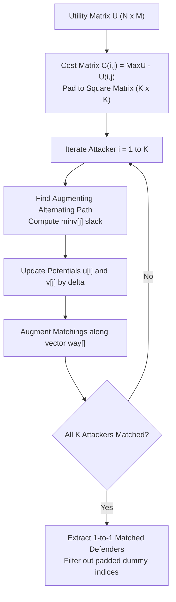

# Mathematical Specification: Kuhn-Munkres War Strategy Optimizer

> Algorithmic formulation and combinatorial optimization spec for attacker-to-defender assignment implemented in `com.kkdev.waroracle.service.strategy.KuhnBipartiteOptimizer` and `com.kkdev.waroracle.service.strategy.WarStrategyServiceImpl`.

---

## 1. Problem Formulation: Maximum Weight Bipartite Matching

Let $A = \{a_1, a_2, \dots, a_N\}$ denote the set of $N$ home clan attackers with remaining attacks, and $D = \{d_1, d_2, \dots, d_M\}$ denote the set of $M$ opponent defender bases not yet 3-starred.

We define a weighted complete bipartite graph $G = (A \cup D, A \times D, w)$, where edge weight $w(a_i, d_j) = U_{i, j}$ represents the computed **tactical utility** of assigning attacker $a_i$ to target base $d_j$.

The objective is to find a 1-to-1 matching $X \subseteq A \times D$ that maximizes total collective clan utility:

$$\max \sum_{(a_i, d_j) \in X} U_{i, j} \quad \text{subject to} \quad \begin{cases}
\sum_{j=1}^{M} x_{i, j} \le 1 & \forall i \in \{1, \dots, N\} \\
\sum_{i=1}^{N} x_{i, j} \le 1 & \forall j \in \{1, \dots, M\} \\
x_{i, j} \in \{0, 1\} & \forall (i, j)
\end{cases}$$

---

## 2. Tactical Utility Matrix Construction

The utility $U_{i, j}$ blends empirical 3-star probability, expected destruction, Town Hall delta penalties, and tactical doctrine biases:

$$U_{i, j} = \left( P_{3\text{star}}(i, j) \cdot W_{\text{star}} \right) + \left( \frac{\mathbb{E}[\text{Dest}_{i, j}]}{100.0} \cdot W_{\text{dest}} \right) - \Phi(\Delta \text{TH}_{i, j}) + \Psi(\text{Mode}, i, j)$$

Where:
- $\Delta \text{TH}_{i, j} = \text{TH}(a_i) - \text{TH}(d_j)$
- $\Phi(\Delta \text{TH})$ represents a non-linear penalty for attacking up or down beyond optimal efficiency ranges.

### 2.1 Tactical Doctrine Modifiers ($\Psi$)

| Strategy Mode | Tactical Objective | $\Phi(\Delta \text{TH} < 0)$ Penalty | $\Phi(\Delta \text{TH} > 1)$ Down-Hit Penalty | Optimization Bias |
| :--- | :--- | :--- | :--- | :--- |
| **`SAFE`** | Maximize guaranteed 3-stars and bottom-up stability | Severe ($10 \times$) | Minor ($0.2 \times$) | Heavily prioritizes $P_{3\text{star}} \ge 0.85$ matches; lower Town Halls hit bottom bases first. |
| **`BALANCED`** | Global star maximization across the full roster | Moderate ($3 \times$) | Moderate ($1.5 \times$) | Balances top-tier clearance with clean 1-to-1 mirror alignment. |
| **`AGGRESSIVE`** | High-risk scout & high-value Town Hall clearance | Light ($0.5 \times$) | High ($4 \times$) | Encourages top attackers to hit up, securing 2 stars on difficult bases to free up lower cleanup attacks. |

---

## 3. Kuhn-Munkres (Hungarian) Algorithm Implementation

To solve the maximum weight matching in polynomial time $O(K^3)$ where $K = \max(N, M)$:

### Step 1: Matrix Square Transformation & Cost Inversion
The rectangular utility matrix $U \in \mathbb{R}^{N \times M}$ is transformed into an equivalent square minimization cost matrix $C \in \mathbb{R}^{K \times K}$:

$$C_{i, j} = U_{\max} - U_{i, j} \quad \text{where } U_{\max} = \max_{i, j} U_{i, j}$$

For padded dummy rows/columns ($i > N$ or $j > M$):
$$C_{i, j} = U_{\max}$$

### Step 2: Dual Potential Vector Maintenance
The algorithm maintains potential vectors $u \in \mathbb{R}^{K+1}$ and $v \in \mathbb{R}^{K+1}$ satisfying the dual feasibility condition:

$$u_i + v_j \le C_{i, j} \quad \forall i, j$$

For each unassigned attacker $i$:
1. Initialize shortest augmenting path search using slack vector:
   $$\text{minv}[j] = \min_{i_0} \left( C_{i_0, j} - u_{i_0} - v_j \right)$$
2. Find minimum delta $\delta = \min_{j \notin \text{used}} \text{minv}[j]$.
3. Update dual potentials:
   $$u_{p[j]} \leftarrow u_{p[j]} + \delta, \quad v_j \leftarrow v_j - \delta \quad \forall j \in \text{used}$$
4. Augment along the alternating path vector `way[]`.

---

## 4. Second-Wave Contingency Planning Heuristic

In addition to the primary Kuhn-Munkres matching, `WarStrategyServiceImpl` generates dynamic contingency cleanup trees:

1. **Vulnerability Heatmap:** Defender bases are ranked by clearance difficulty:
   $$\text{VulnerabilityScore}(d_j) = \frac{\sum_{i=1}^{N} P_{3\text{star}}(i, j)}{N}$$
2. **Cleanup Priority Queue:** Bases failing to achieve 3 stars during Wave 1 are automatically queued for secondary hit reassignment based on remaining roster attack power and Town Hall differential tolerance.
